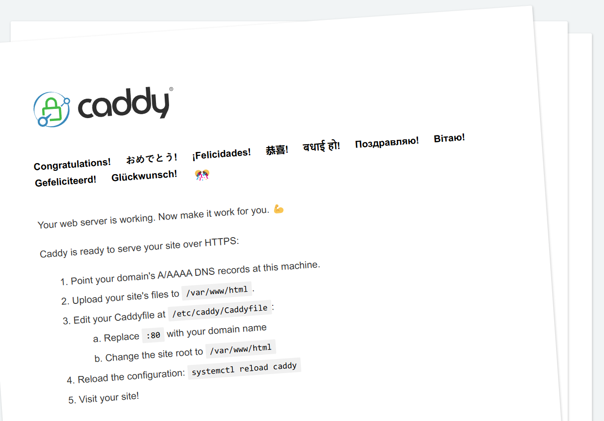
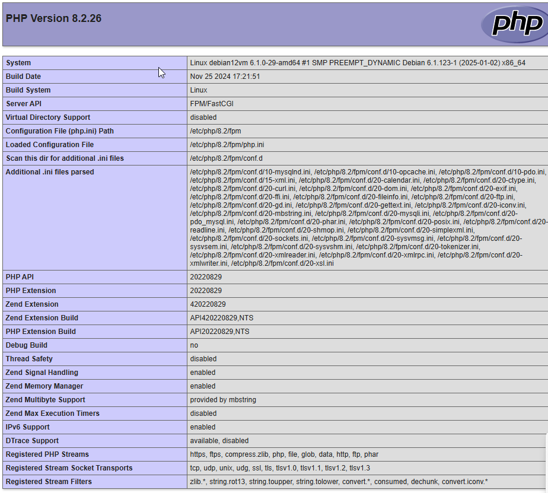
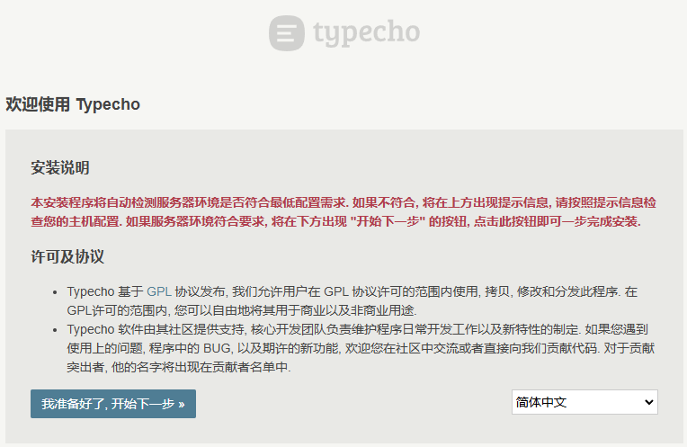
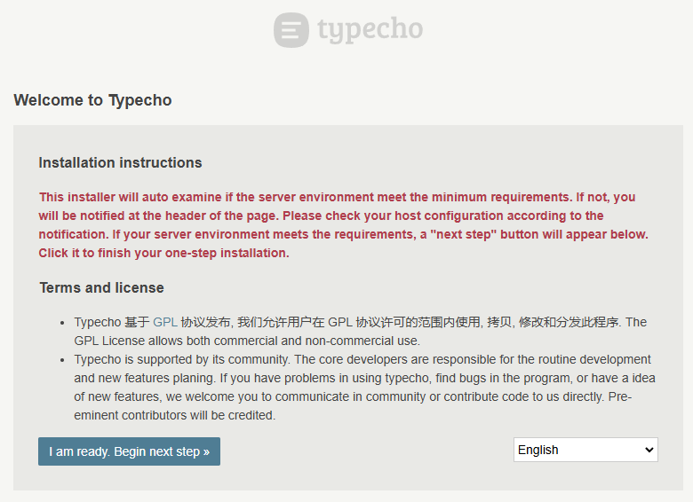
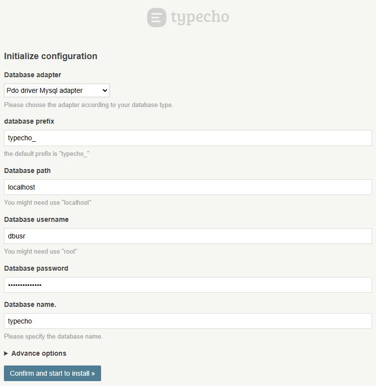
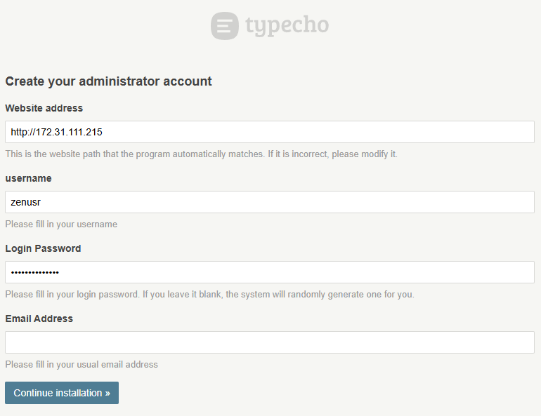
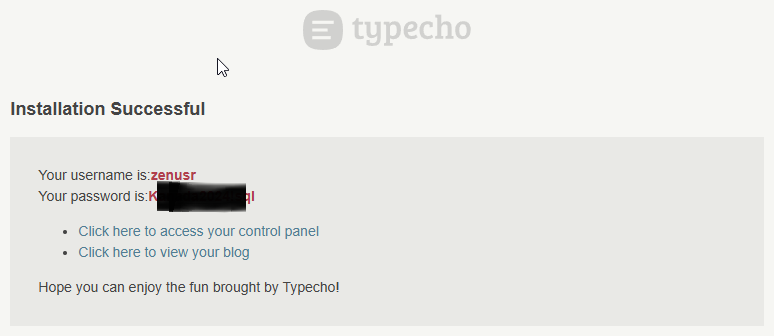

# Install Caddy, PHP, MySQL + Typecho blog w/o Docker

by Marcus Zou | 16 Feb 2025


## Intro 

I've been searching the best personal blog system for decades, and eventually the Chinese-made [Typecho](https://typecho.org) came into eyesight.

`Typecho` is a blogging app developed with PHP by a Chinese IT company, supporting MySQL, PostgreSQL and SQLite. 

`Typecho` is the BEST of the BESTs as it's -

- Lightweight
- Supporting MySQL, PostgreSQL and SQLite
- Just-in-time, fit-for-purpose
- State of Art design
- Chinese oriented

#### Prerequisites

- An Debian 12 / Debian 20/22/24 server with a non-root account having `sudo` privileges.
- A fully registered domain name pointed to your server's IP address.


## 1- Install Caddy Web Server

Caddy Web Server is a modern open-source web server written in GO language. It doesn't have any dependencies and runs off of a static binary file and generates and renews SSL certificates automatically. It can work as a static file server, scalable reverse proxy or a powerful dynamic server and can be expanded via plugins. It also includes support for HTTP/2 and experimental HTTP/3 protocols.

I would take my Debian 12 as my working platform and Caddy as web server (Apache2 is great, but just want to try something new).

Pre-requisite installing:

```shell
sudo apt update
sudo apt install curl git nano wget zip unzip -y
## Install OpenSSH Server for remote accessing
sudo apt install ssh -y
sudo systemctl enable ssh
sudo systemctl start ssh
sudo systemctl status ssh
## IP address of your Linux box
ip a
```

First, install all required dependencies using the following command:

```shell
sudo apt install debian-keyring debian-archive-keyring apt-transport-https -y
```

Next, download and add the GPG key with the following command:

```shell
curl -1sLf 'https://dl.cloudsmith.io/public/caddy/stable/gpg.key' | sudo gpg --dearmor -o /usr/share/keyrings/caddy-stable-archive-keyring.gpg
```

Next, add a Caddy repository to the APT using the following command:

```shell
curl -1sLf 'https://dl.cloudsmith.io/public/caddy/stable/debian.deb.txt' | sudo tee /etc/apt/sources.list.d/caddy-stable.list
```

Next, update the repository and install the Caddy web server by running the following command:

```shell
sudo apt update
sudo apt install caddy -y
```

Check the version:

```shell
caddy version
## v2.9.1 h1:OEYiZ7DbCzAWVb6TNEkjRcSCRGHVoZsJinoDR/n9oaY=
```

Next, you will need to set some permission to allow the caddy binary to connect to privileged ports like 80 and 443. You can set it with the following command:

```shell
sudo setcap 'cap_net_bind_service=+ep' /usr/bin/caddy
```

Caddy shall run on `localhost` with port 80 by default. then access the webpage at: http://localhost or http://172.31.111.215/.



In case of not-started caddy server, please try:

```shell
sudo systemctl enable caddy
sudo systemctl start caddy
sudo systemctl status caddy
```


## 2A- Install PHP Extensions to Support Caddy

> Note:
>
> Please do Not install `php` since it will come up with a full set of `Apache2` apps. 
>
> We are not using `Apache2` web server, but the latest `caddy` web server.

First, install PHP and other necessary extensions using the following command:

```shell
sudo apt install php-fpm php-curl php-mbstring php-mysql php-pgsql php-sqlite3 php-gd php-xml php-xmlrpc php-zip php-imagick -y
```

After installing PHP extensions, edit the PHP-FPM configuration file and change the default user and group with caddy:

```shell
sudo nano /etc/php/8.1/fpm/pool.d/www.conf
```

Find and replace user and group name from www-data to caddy:

> ```
> user = caddy
> group = caddy
> listen.owner = caddy
> listen.group = caddy
> ```

Save and close the file then restart the PHP-FPM service to apply the changes:

```shell
sudo systemctl restart php8.1-fpm
```

Check the status of `php-fpm`:

```shell
sudo systemctl status php8.1-fpm
```


## 2B- Create Caddy Virtual Host Configuration File

The Caddy default virtual host configuration file is located at `/etc/caddy/Caddyfile`.

Edit the `/etc/caddy/Caddyfile` file with the following command:

```shell
sudo nano /etc/caddy/Caddyfile
```

Remove all lines and add the following lines:

> ```
> :80 {
>  root * /usr/share/caddy/
>  file_server
>  encode gzip zstd
>  php_fastcgi unix//run/php/php8.1-fpm.sock
> }
> ```

Save and close the file then restart the Caddy service to apply the changes:

```shell
sudo systemctl restart caddy
```

Next, create a sample PHP file for Caddy with the following command:

```shell
sudo nano /usr/share/caddy/index.php
```

Add the following lines:

> ```
> <?php
> phpinfo();
> ?>
> ```

Now, open your web browser and access the Caddy website using the URL **http://localhost/index.php.** You should see the PHP page on the following screen:




## 3A- Install MySQL 8.40 / MariaDB 11.4

MariaDB is a drop-in replacement for MySQL which means commands to run and operate MariaDB are the same as those for MySQL.

Add MariaDB's Official repository. You can opt for a different mirror which is closer to your server's location from [MariaDB's repository page](https://downloads.mariadb.org/mariadb/repositories/#distro=Ubuntu&distro_release=focal--ubuntu_focal).

```shell
sudo apt install curl apt-transport-https software-properties-common
sudo apt-key adv --fetch-keys 'https://mariadb.org/mariadb_release_signing_key.asc'
sudo add-apt-repository 'deb [arch=amd64] https://mirrors.xtom.nl/mariadb/repo/11.4/debian bookworm main'
```

Please note: the web address of the repo could vary per your location. The above `https://mirrors.xtom.nl` is a repo host in Netherland, targeting Debian 12 (code suite: "bookworm").

If the system is Ubuntu 22.04, the commands shall be like:

```shell
sudo apt install curl apt-transport-https software-properties-common
sudo apt-key adv --fetch-keys 'https://mariadb.org/mariadb_release_signing_key.asc'
sudo add-apt-repository 'deb [arch=amd64] https://atl.mirrors.knownhost.com/mariadb/repo/11.4/ubuntu jammy main'
```

To install MariaDB, issue the following command.

```shell
sudo apt update
sudo apt install mariadb-server 
sudo apt install libmysqlclient21
```

Check if MariaDB installed correctly.

```shell
mysql --version
mariadb --version
```

You should see the following output.

> mariadb from 11.4.5-MariaDB, client 15.2 for debian-linux-gnu (x86_64) using  EditLine wrapper

Enable the MariaDB service.

```shell
sudo systemctl enable mariadb
sudo systemctl start mariadb
sudo systemctl status mariadb
```


## 3B- Configure MySQL/MariaDB

Run the following command to perform default configuration such as giving a root password, removing anonymous users, disallowing root login remotely and dropping test tables.

```shell
sudo mysql_secure_installation
```

With MariaDB 11.4, you will now be asked between using the root password or `unix_socket` plugin. The `unix_socket` plugin allows you to log in to MariaDB with your Linux user credentials. It is considered more secure though you will need a traditional username/password to use 3rd party apps like phpMyAdmin. We will stick to using `unix_socket` plugin for this tutorial. You can still use phpMyAdmin via any user you specific user you create for your databases.

Pressing Enter chooses the default option (the one that is capitalised, Y in this case).

> ```ssh
> NOTE: RUNNING ALL PARTS OF THIS SCRIPT IS RECOMMENDED FOR ALL MariaDB
>       SERVERS IN PRODUCTION USE!  PLEASE READ EACH STEP CAREFULLY!
> 
> In order to log into MariaDB to secure it, we'll need the current
> password for the root user. If you've just installed MariaDB, and
> haven't set the root password yet, you should just press enter here.
> 
> Enter current password for root (enter for none): [PRESS ENTER]
> OK, successfully used password, moving on...
> 
> Setting the root password or using the unix_socket ensures that nobody
> can log into the MariaDB root user without the proper authorisation.
> 
> You already have your root account protected, so you can safely answer 'n'.
> 
> Switch to unix_socket authentication [Y/n] [PRESS ENTER]
> Enabled successfully!
> Reloading privilege tables..
>  ... Success!
> 
> You already have your root account protected, so you can safely answer 'n'.
> 
> Change the root password? [Y/n] [ANSWER n] Or [ANSWER Y to change Root passward]
> ... skipping.
> 
> By default, a MariaDB installation has an anonymous user, allowing anyone
> to log into MariaDB without having to have a user account created for
> them.  This is intended only for testing, and to make the installation
> go a bit smoother.  You should remove them before moving into a
> production environment.
> 
> Remove anonymous users? [Y/n] [PRESS ENTER]
>  ... Success!
> 
> Normally, root should only be allowed to connect from 'localhost'.  This
> ensures that someone cannot guess at the root password from the network.
> 
> Disallow root login remotely? [Y/n] [PRESS ENTER]
>  ... Success!
> 
> By default, MariaDB comes with a database named 'test' that anyone can
> access.  This is also intended only for testing, and should be removed
> before moving into a production environment.
> 
> Remove test database and access to it? [Y/n] [PRESS ENTER]
>  \- Dropping test database...
>  ... Success!
>  \- Removing privileges on test database...
>  ... Success!
> 
> Reloading the privilege tables will ensure that all changes made so far
> will take effect immediately.
> 
> Reload privilege tables now? [Y/n] [PRESS ENTER]
>  ... Success!
> 
> Cleaning up...
> 
> All done!  If you've completed all of the above steps, your MariaDB
> installation should now be secure.
> 
> Thanks for using MariaDB!
> ```

Log in to the MariaDB's SQL Shell.

```shell
sudo mysql
## sudo mariadb
```

Enter your root password when prompted.

Create a test database and user with access permission. Replace `database` and `zenusr` with your choice. Replace `password` with a strong password.

```mysql
CREATE DATABASE IF NOT EXISTS typecho;
CREATE USER 'zenusr'@'localhost' IDENTIFIED BY 'userP@ss2024';
GRANT ALL PRIVILEGES ON typecho.* TO 'zenusr'@'localhost' WITH GRANT OPTION;
FLUSH PRIVILEGES;
```

Exit the MySQL Shell.

```mysql
exit
```

Note: 

Sometimes you will face an issue of "`mysql_native_password` not loaded errors on MySQL 8.4". 

One of the major changes introduced in MySQL 8.4 or MariaDB 11.4 (the latest LTS release as of 2024) is that the "`MySQL Native Password`" plugin is no longer enabled by default. Furthermore, MySQL 9.0 (MariaDB 12.0?) removes this plugin completely.

This change affects PHP and other applications that use MySQL database with the `mysql_native_password` authentication plugin. Because the `mysql_native_password` plugin is no longer loaded by default or not available at all, PHP PDO/MySQLi connections fail. 

PHP has support for `caching_sha2_password` authentication [since PHP 7.4](https://php.watch/articles/PHP-7.4-MySQL-8-server-gone-away-fix). To fix this error, **change the authentication plugin of the MySQL user to `caching_sha2_password`**.

Anyhow, the walkaround is to re-enable MySQL Native Password Plugin by editing the file: 

```shell
sudo nano /etc/mysql/conf.d/mysql-native-password.conf
```

And put the contents in:

```shell
# Enable mysql_native_password plugin
[mysqld]
mysql_native_password=ON
```

or Turn it OFF completely, as such to use the latest `caching_sha2_password` following the trend.


## 4- Configure Caddy

Caddy can be configured in several ways - API calls, JSON file or a `Caddyfile`. `Caddyfile` is the easiest way to configure Caddy which we will use in our tutorial.

Before we configure Caddy, we should create the root directory for our site.

```shell
sudo mkdir -p /var/www/html
```

`-p` flag creates any missing parent directories as well.

We also need to create a directory to store the log files for Caddy.

```shell
sudo mkdir -p /var/log/caddy
```

Caddy server on installation creates a user `caddy` which handles its tasks for it. We need to give permissions to the log directory so that Caddy can access and write to it.

```shell
sudo chown -R caddy:caddy /var/log/caddy
```

During installation, Caddy generated a default `Caddyfile` at `/etc/caddy/Caddyfile`. Open it.

```shell
sudo nano /etc/caddy/Caddyfile
```

It should look something like the following.

```yaml
# The Caddyfile is an easy way to configure your Caddy web server.
#
# Unless the file starts with a global options block, the first
# uncommented line is always the address of your site.
#
# To use your own domain name (with automatic HTTPS), first make
# sure your domain's A/AAAA DNS records are properly pointed to
# this machine's public IP, then replace the line below with your
# domain name.
:80

# Set this path to your site's directory.
root * /usr/share/caddy

# Enable the static file server.
file_server

# Another common task is to set up a reverse proxy:
# reverse_proxy localhost:8080

# Or serve a PHP site through php-fpm:
# php_fastcgi localhost:9000

# Refer to the Caddy docs for more information:
# https://caddyserver.com/docs/caddyfile
```

`:80` tells Caddy to serve everything over port number 80. `root` sets the path for your site's home directory. `file_server` enables Caddy to run as a static file server.

Replace the above code with the following code.

```yaml
:80 {
    root * /var/www/html
    file_server
    log {
        output file /var/log/caddy/example.com.access.log {
            roll_size 3MiB
            roll_keep 5
            roll_keep_for 48h
            }
        format json
        }
    encode gzip zstd
    php_fastcgi unix//run/php/php8.1-fpm.sock
    }
```

Let us go through all sections of the `Caddyfile` below.

- The main block is the `site block`. If you have just 1 site on your server, you don't need to enclose your configuration in a block but if you are going to host multiple sites, you should host each site's configuration in its own block. A site block is marked by curly brackets. Every site block starts with the hostname of the site.
- `log` enables and configures HTTP request logging. Without the `log` directive, Caddy won't log anything. `output` configures where to write the log file to. `format` describes how to encode, or format, the logs. The `console` formats the log entry for human readability.
- `encode` directive here enables `Gzip` and `Zstandard` compression for the site.
- `php_fastcgi` proxies requests to a PHP `FastCGI` server such as `php-fpm`. Here we are listening to requests over a Unix socket.
- `tls` block configures settings related to SSL certificates and security. Here, we have enabled support for both TLSv1.2 and TLSv1.3 protocols. By default, Caddy supports TLS v1.2 out of the box. Caddy also generates SSL certificates automatically for all sites. If you don't want Caddy to generate SSL for you, you can do so by either using the IP address instead of the hostname or specify the full URL i.e. [http://example.com](http://example.com/). In such cases, Caddy won't generate the SSL certificate.

So far we have covered the absolute basics of writing a `Caddyfile` which should help you get started. You can read more about it in the [official documentation](https://caddyserver.com/docs/caddyfile).


## 5- Launch Demo Site

Now that we have created a `Caddyfile` and configured PHP to run with the server, it is time to create and launch a demo website.

Make sure your domain name is pointed to the server's IP address.

Copy the files from `/usr/share/caddy/` to your new www folder: `/var/www/html`:

```shell
sudo cp /usr/share/caddy/* /var/www/html/
```

Restart Caddy server to apply the changes in the `Caddyfile` we created above.

```shell
sudo systemctl restart caddy
```

Check the status of the Caddy server to make sure it is working properly.

```shell
sudo systemctl status caddy
```

Then access the Caddy web server:

- http://localhost/index.html
- http://localhost/index.php


## 6- Install Typecho Blog system

6a). Make sure the prerequisites are met as per the official website: https://docs.typecho.org/install.

- PHP 7.4+

- PHP extensions: curl, mbstring or iconv

  ```shell
  sudo apt install php-curl        ## PHP Extension for CURL
  sudo apt insrall php-mbstring    ## PHP Extension for mbstring
  sudo apt install php-common      ## PHP Extension for iconv is included in `php-common`
  ```

- Database: MySQL, or PostgreSQL, or SQLite and its relevant PHP extension.

  ```shell
  sudo apt install php-mysql    ## PHP Extension for MySQL
  sudo apt insrall php-pgsql    ## PHP Extension for PostgreSQL
  sudo apt install php-sqlite3  ## PHP Extension for SQlite
  ```

6b). Download stable version of `Typecho` from https://github.com/typecho/typecho/releases/latest/download/typecho.zip, and  the language pack from: https://github.com/typecho/languages/releases/download/ci/langs.zip then unzip both zip files to the web folder:

```shell
wget https://github.com/typecho/typecho/releases/latest/download/typecho.zip
## unzip the installer of Typecho to the main folder
sudo unzip ./typecho.zip -d /var/www/html/

wget https://github.com/typecho/languages/releases/download/ci/langs.zip
## Unzip the language pack to subfolder: /usr/langs
sudo unzip ./langs.zip -d /var/www/html/usr/langs/

## Also remove the copied files in previous step
sudo rm /var/www/html/index.html
```


Optionally install the themes and plugins:

```shell
## theme install
sudo unzip ./themes/theme-MWordStar-2.6-bundle.zip -d /var/www/html/usr/themes/
## plugin install
sudo unzip ./plugins/plugin-ColorHighlight-for-typecho.zip -d /var/www/html/usr/plugins/
sudo unzip ./plugins/plugin-Likes-for-typecho.zip -d /var/www/html/usr/plugins/
sudo unzip ./plugins/plugin-PostTOC-for-typecho.zip -d /var/www/html/usr/plugins/
sudo unzip ./plugins/plugin-TypechoPDF.zip -d /var/www/html/usr/plugins/
sudo unzip ./plugins/plugin-ViewsCounter-for-typecho.zip -d /var/www/html/usr/plugins/
sudo unzip ./plugins/plugin-YoutubeEmdedding-for-typecho.zip -d /var/www/html/usr/plugins/
```


Then if you run the command:

```shell
tree /var/www/html/
```

you should have a folder structure be like:

> ```
> /admin/
> /install/
> /usr/
> /var/
> /license.txt  
> /index.php
> /install.php
> ```

6c). Configure the ownership and privileges of the web root folder prior to the setup journey. Otherwise you will encounter error:  "`File not exist`" or likewise:

```shell
## change the ownership of the folder
sudo chown -R caddy:caddy /var/www/html
## Change the mode/privileges of the folder
sudo chmod -Rf 755 /var/www/html

## restart the caddy.service
sudo systemctl restart caddy
```

Open a browser to http://localhost. The website will be re-directed to the install process: http://172.31.111.215/install.php, which be like:



I'll switch to "English" edition by clicking the lower-right dropdown box, then you will have:



Most likely you will encounter an issue of:

> 上传目录无法写入, 请手动将安装目录下的 /usr/uploads 目录的权限设置为可写然后继续升级
>
> The upload directory cannot be written. Please manually set the permissions of the /usr/uploads directory under the installation directory to be writable and then continue the upgrade

Then we have to go back to the web server directory and set the `/var/www/example.com/html/usr/uploads` folder writable by user `caddy`.

```shell
cd /var/www/example.com/html
sudo chown caddy:caddy -Rf ./usr/uploads/
## For other cases: sudo chown www-data:www-data ./usr/uploads/
sudo chmod 755 -R ./usr/uploads/
```

Then refresh the webpage, you should be able to proceed to the "Initial configuration".



if you forget to change the ownership of step 6c), most likely, you will encounter another issue of:

> The installer cannot automatically create the **config.inc.php** file. You can manually create the **config.inc.php**
> file in the root directory of the website and copy the following code into it.

The reason is because `.../example.com/html/` folder is owned by `root` user while all operations shall be done with user `caddy`. Considering future operations are all by user `caddy`, then best solution is not manually creating the `config.inc.php` file, but modify the ownership of the `.../example.com/htm;/` folder:

```shell
sudo chown -R caddy:caddy /var/www/html/
## For other cases: sudo chown www-data:www-data /var/www/typecho/
```

Then refresh the webpage of `Initial Configuration`, the you will be okay to proceed to next page:



Then you will reach the final step:



Enjoy the show!

## 7- Backup and Restore MySQL database
 A simple way to achieve such is to use a tool called `mariadb-dump`. 
 
 Here is the detailed procedure for your reference.
 [mariadb-dump](./Backup%20and%20Restore%20Databases%20with%20mariadb-dump.md) 

## The End
